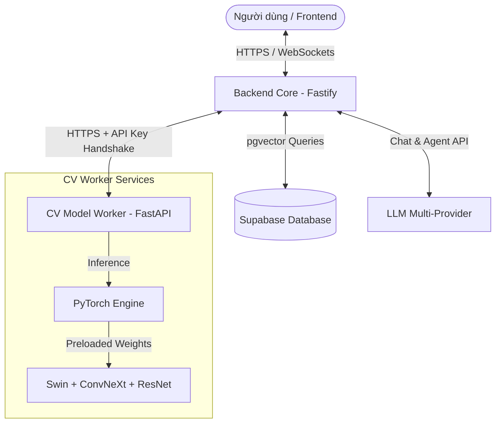

# Kiến trúc Hệ thống Medagen V2

Tài liệu này mô tả chi tiết kiến trúc kỹ thuật của hệ thống chẩn đoán y tế thông minh **Medagen V2**. Dự án được xây dựng theo mô hình **Monorepo** chia tách dịch vụ độc lập, tối ưu hóa cho môi trường đám mây (Cloud-Native) và có khả năng deploy tự động lên **Hugging Face Spaces**.

---

## 1. Tổng quan Kiến trúc (System Architecture)

Medagen V2 là một hệ thống phân tán bao gồm hai dịch vụ chính hoạt động độc lập và giao tiếp bảo mật với nhau:



### Thành phần Hệ thống:
1. **Frontend App (Next.js):** Giao diện tương tác người dùng, gửi ảnh chụp triệu chứng và chat trực tiếp thời gian thực.
2. **Backend Core (Node.js + Fastify):** Đóng vai trò là bộ não điều khiển (Agent), xử lý RAG (Retrieval-Augmented Generation), quản lý session chat, kết nối Supabase và điều phối các công cụ (Tools).
3. **CV Worker (Python + FastAPI):** Chuyên gia xử lý hình ảnh y tế bằng học sâu (Deep Learning), hoạt động độc lập trên GPU server.
4. **Supabase Vector DB (PostgreSQL + pgvector):** Lưu trữ lịch sử hội thoại, tri thức y tế dạng Vector Embeddings (Gemini 1,500+ hoặc các vector tương thích 768-dim), và kết quả chẩn đoán.

---

## 2. Dịch vụ Backend Core (`/backend`)

Dịch vụ backend chịu trách nhiệm điều phối toàn bộ nghiệp vụ logic của hệ thống.

```
/backend
├── src/
│   ├── agent/          # Logic ReAct Agent & Triage Rules
│   ├── api/            # API Route & Controller
│   ├── config/         # Swagger & Zod Env Validator
│   ├── providers/      # LLM Factory (Google, OpenAI, OpenRouter, etc.)
│   ├── services/       # Supabase, Google Maps, CV integration
│   ├── utils/          # Logger & Helpers
│   └── index.ts        # Server entry point
├── tests/              # Test suite (Vitest)
└── Dockerfile          # Multi-stage production build
```

### Các Đặc trưng Công nghệ nổi bật:
* **Fastify Web Server:** Sử dụng Fastify thay vì Express để tối ưu hóa hiệu năng, giảm thiểu overhead và hỗ trợ WebSocket gốc với hiệu suất cực cao.
* **LLM Multi-Provider Factory:**
  - Tích hợp lớp abstraction thông minh tại `src/providers/llm.factory.ts`.
  - Cho phép chuyển đổi linh hoạt giữa các nhà cung cấp mô hình ngôn ngữ lớn (Google Gemini, OpenAI GPT, OpenRouter, Alibaba DashScope, Ollama) chỉ bằng việc thay đổi cấu hình biến môi trường `LLM_PROVIDER`.
* **ReAct Agent & MCP Tools:**
  - Triển khai mô hình tác nhân ReAct (Reasoning and Acting).
  - Agent có khả năng tự động phân tích ý định của người dùng và kích hoạt các công cụ (Tools) phù hợp như: `Triage Tool` (Luật phân loại), `CV Tool` (Nhận diện ảnh bệnh học), `Knowledge RAG Tool` (Tìm kiếm tri thức y tế), và `Google Maps Tool` (Tìm kiếm bệnh viện gần nhất).
* **Zod Environment Validation:** Tất cả biến môi trường được parse và xác thực nghiêm ngặt bằng Zod tại thời điểm khởi động server, ngăn chặn lỗi thiếu tham số khi deploy lên Cloud.

---

## 3. Dịch vụ CV Worker (`/cv-worker`)

Dịch vụ Python đóng vai trò là một worker chuyên biệt phục vụ các tác vụ tính toán học sâu (Deep Learning Inference) nặng.

```
/cv-worker
├── src/
│   ├── models/         # Kiến trúc mạng PyTorch (ViTCNNHybrid, CBAMResNet18)
│   ├── services/       # Logic tải model & suy luận ảnh (Inference)
│   └── main.py         # FastAPI Web Application & Lifespan handler
├── models/             # Chứa file trọng số mô hình (.pth)
├── tests/              # Test suite (Pytest)
├── pytest.ini          # Tự động hóa đường dẫn Python
└── Dockerfile          # Đóng gói Python environment (tương thích GPU CUDA)
```

### Các Đặc trưng Công nghệ nổi bật:
* **Loại bỏ Gradio chuyển sang FastAPI:** Giúp chuẩn hóa giao tiếp dưới dạng REST API JSON chính thống, tăng tính bảo mật và dễ dàng mở rộng băng thông xử lý.
* **Mạng Neural Y tế chuyên sâu:**
  - **Swin-Tiny + ConvNeXt-Tiny + CBAM:** Nhận diện 23 nhóm bệnh da liễu (DermNet).
  - **CBAM + ResNet-18:** Nhận diện các tổn thương và bệnh lý răng miệng (Teeth) và móng (Nail).
* **Mở khóa Cold Start Latency (Lifespan Preload):**
  - Sử dụng FastAPI `lifespan` handler để tự động load toàn bộ file trọng số `.pth` từ đĩa cứng vào bộ nhớ RAM/GPU ngay khi container vừa khởi động.
  - Đảm bảo thời gian phản hồi cho request đầu tiên của người dùng cực kỳ nhanh chóng.
* **Shared API Key Handshake:** 
  - Bảo vệ API bằng Header `X-API-Key`. Chỉ những request mang theo Secret Key trùng khớp với cấu hình hệ thống mới được phép kích hoạt tính năng suy luận AI, ngăn chặn tối đa việc lạm dụng tài nguyên GPU công cộng.

---

## 4. Cơ sở dữ liệu Supabase Schema

Toàn bộ lược đồ dữ liệu được tích hợp đồng bộ vào một file migration duy nhất tại `/supabase/migration.sql`.

### Bảng dữ liệu lõi:
1. **`guidelines` & `guideline_chunks`:** Chứa dữ liệu phác đồ chẩn đoán được băm nhỏ thành các Vector Embeddings (768 chiều) phục vụ tìm kiếm ngữ nghĩa (RAG).
2. **`specialties`, `diseases`, `info_domains`, `medical_knowledge_chunks`:** Hệ thống cơ sở dữ liệu tri thức y khoa phân cấp chặt chẽ (Chuyên khoa -> Tên bệnh -> Miền thông tin) phục vụ tìm kiếm ngữ nghĩa nâng cao có bộ lọc.
3. **`sessions`:** Lưu trữ kết quả phân loại lâm sàng (Triage Level: Đỏ, Vàng, Xanh lá...) và vị trí của người dùng.
4. **`conversation_sessions` & `conversation_history`:** Quản lý hội thoại đa lượt, hỗ trợ đính kèm hình ảnh và kết quả triage trực tiếp vào đoạn chat.
5. **`tool_executions`:** Theo dõi hành trình đưa ra quyết định của Agent (ghi lại tên công cụ, tham số đầu vào, kết quả phản hồi của từng bước).
6. **`comprehensive_reports`:** Lưu trữ các báo cáo chẩn đoán tổng hợp định dạng JSON và Markdown được tạo ra ở cuối quy trình triage để trả về cho Frontend.

---

## 5. Quy trình Triển khai tự động CI/CD

Hệ thống hỗ trợ quy trình phân tách deploy tự động (Independent CD) lên hai Hugging Face Spaces riêng biệt qua GitHub Actions:

```
                  ┌────────────── [ GitHub Repository ] ──────────────┐
                  │                                                   │
         Mã nguồn thay đổi ở /backend       Mã nguồn thay đổi ở /cv-worker
                  │                                                   │
                  ▼                                                   ▼
       [ deploy-backend.yml ]                              [ deploy-cv-worker.yml ]
                  │                                                   │
          Build & Push Docker                                 Build & Push Docker
                  │                                                   │
                  ▼                                                   ▼
     [ HF Space: medagen-backend ]                       [ HF Space: medagen-cv-worker ]
```

* **Trình kích hoạt thông minh (Path Filtering):** Các workflow của GitHub chỉ kích hoạt khi có thay đổi thực tế trong phân vùng tương ứng (ví dụ: thay đổi ở `cv-worker/**` sẽ không ảnh hưởng hay trigger build lại `backend/**`).
* **Dockerized Hosting:** Cả hai dịch vụ đều chạy dưới dạng Docker Space của Hugging Face, đảm bảo tính nhất quán tuyệt đối giữa môi trường phát triển local và môi trường deploy Production.
