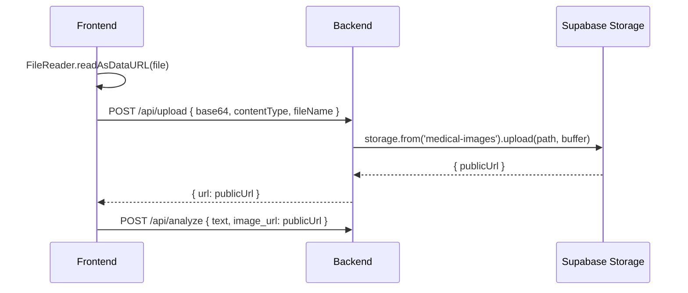
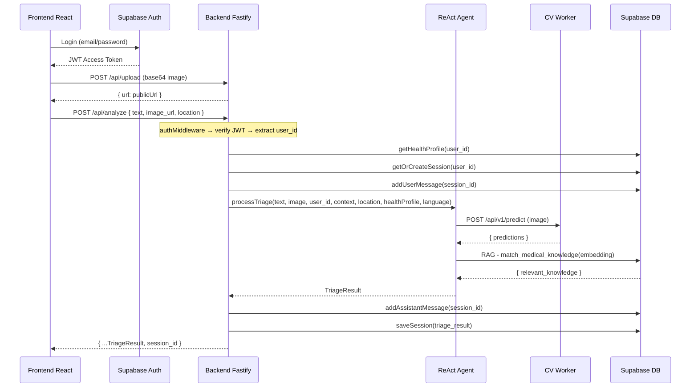
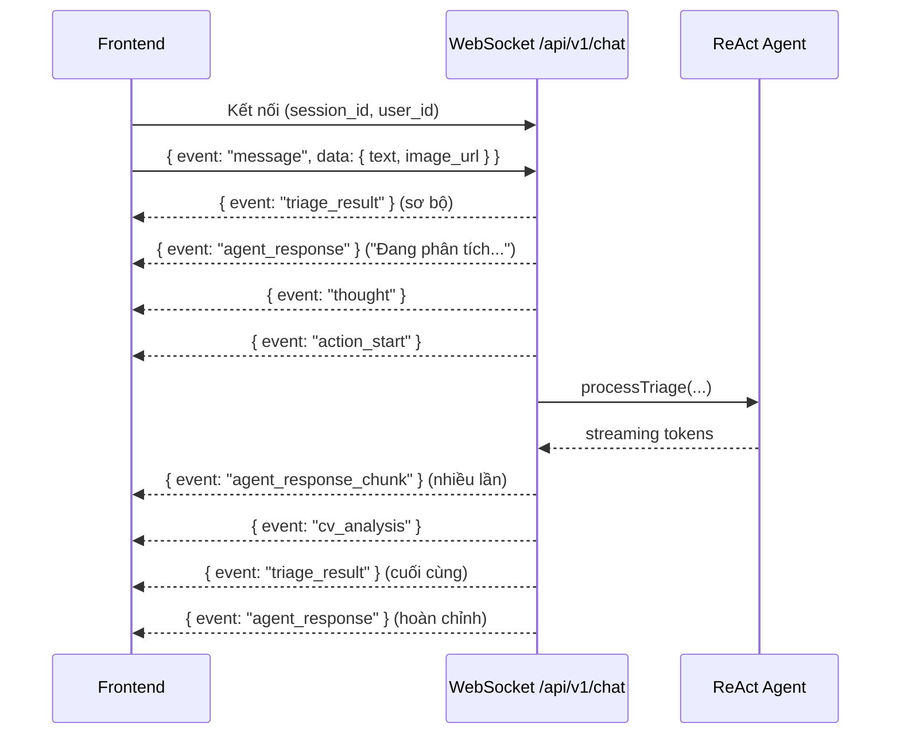

# Tài liệu Đặc tả API — Frontend ↔ Backend Medagen V2

> **Phiên bản:** 2.0 · Cập nhật: 2026-05-28
> **Stack:** Frontend (React + Vite + TailwindCSS) · Backend (Fastify + TypeScript) · Auth (Supabase Auth) · DB (Supabase PostgreSQL + pgvector)

---

## Mục lục

1. [Tổng quan Kiến trúc API](#1-tổng-quan-kiến-trúc-api)
2. [Kết nối & Cấu hình](#2-kết-nối--cấu-hình)
3. [Xác thực (Authentication)](#3-xác-thực-authentication)
4. [REST API — Nhóm Authenticated (`/api/*`)](#4-rest-api--nhóm-authenticated-api)
5. [REST API — Nhóm Public (`/api/v1/*`)](#5-rest-api--nhóm-public-apiv1)
6. [WebSocket — Real-time Agent Chat](#6-websocket--real-time-agent-chat)
7. [Luồng Upload Hình ảnh Y tế](#7-luồng-upload-hình-ảnh-y-tế)
8. [Đặc tả Kiểu dữ liệu (TypeScript Interfaces)](#8-đặc-tả-kiểu-dữ-liệu-typescript-interfaces)
9. [Đặc tả Trạng thái Lỗi](#9-đặc-tả-trạng-thái-lỗi)
10. [Sơ đồ Luồng Dữ liệu](#10-sơ-đồ-luồng-dữ-liệu)

---

## 1. Tổng quan Kiến trúc API

Medagen V2 Backend cung cấp **hai nhóm API song song**, phục vụ hai mô hình tích hợp khác nhau:

| Nhóm | Prefix | Auth | Mục đích |
|:---|:---|:---|:---|
| **Authenticated REST** | `/api/*` | `Bearer <Supabase JWT>` | Frontend React App — đầy đủ tính năng: phân tích, chat, upload, hồ sơ sức khỏe, care plan, lịch sử |
| **Public REST + WS** | `/api/v1/*` | Không bắt buộc | Demo / external integration — tạo session, triage đơn lẻ, WebSocket chat |

> **Frontend React App chỉ sử dụng nhóm Authenticated (`/api/*`).** Nhóm Public (`/api/v1/*`) dành cho demo nhanh hoặc tích hợp bên ngoài.

---

## 2. Kết nối & Cấu hình

### 2.1. Base URLs

| Môi trường | REST API | WebSocket |
|:---|:---|:---|
| **Development** | `http://localhost:3000` | `ws://localhost:3000` |
| **Production** | `https://<HF-USERNAME>-medagen-backend.hf.space` | `wss://<HF-USERNAME>-medagen-backend.hf.space` |

### 2.2. Frontend Environment Variables (`.env`)

```env
VITE_SUPABASE_URL=https://xxxxx.supabase.co
VITE_SUPABASE_ANON_KEY=eyJ...
VITE_API_URL=http://localhost:3000
VITE_GOOGLE_MAPS_API_KEY=AIza...
```

### 2.3. Utility Endpoints

| Method | Path | Mô tả |
|:---|:---|:---|
| `GET /` | Root | Kiểm tra API đang chạy: `{ status: "ok", message: "..." }` |
| `GET /health` | Health Check | Trả về `{ status, environment, llm_provider }` |
| `GET /docs` | Swagger UI | Tài liệu API tương tác |

---

## 3. Xác thực (Authentication)

Frontend sử dụng **Supabase Auth** để đăng nhập/đăng ký. Mọi request tới nhóm Authenticated đều yêu cầu header:

```
Authorization: Bearer <supabase_access_token>
Content-Type: application/json
```

### 3.1. Lấy Token từ Supabase Client

```typescript
import { supabase } from '../lib/supabase'

async function getAuthHeader(): Promise<Record<string, string>> {
  const { data } = await supabase.auth.getSession()
  const token = data.session?.access_token
  if (!token) throw new Error('Not authenticated')
  return {
    Authorization: `Bearer ${token}`,
    'Content-Type': 'application/json'
  }
}
```

### 3.2. Backend Middleware

Backend giải mã JWT bằng `supabase.auth.getUser(token)` và inject `request.user = { user_id }` vào request context. Nếu token không hợp lệ → `401 Unauthorized`.

---

## 4. REST API — Nhóm Authenticated (`/api/*`)

> Tất cả endpoint trong nhóm này đều yêu cầu `Authorization: Bearer <token>`.
> Backend tự trích xuất `user_id` từ JWT, **không cần gửi `user_id` trong body**.

---

### 4.1. `POST /api/analyze` — Phân tích Triệu chứng AI

Endpoint chính để gửi triệu chứng (text + ảnh tùy chọn) và nhận kết quả chẩn đoán từ ReAct Agent.

**Request Body:**

```json
{
  "text": "Tôi bị nổi mẩn đỏ ngứa nhiều ở mu bàn tay từ hôm qua sau khi làm vườn.",
  "image_url": "https://xxxxx.supabase.co/storage/v1/object/public/medical-images/user-id/1716000000.jpg",
  "location": { "lat": 21.028511, "lng": 105.804817 },
  "session_id": "a9b8c7d6-...",
  "language": "vi"
}
```

| Field | Type | Bắt buộc | Mô tả |
|:---|:---|:---|:---|
| `text` | `string` | ≥1 trong `text`/`image_url` | Mô tả triệu chứng |
| `image_url` | `string` | ≥1 trong `text`/`image_url` | URL ảnh y tế (upload trước qua `/api/upload`) |
| `location` | `{ lat, lng }` | Không | Tọa độ GPS để tìm bệnh viện gần nhất |
| `session_id` | `string` | Không | ID phiên chat có sẵn để tiếp tục hội thoại |
| `language` | `string` | Không | Ngôn ngữ phản hồi: `vi`, `en`, `fr`, `zh` (mặc định: `vi`) |

**Response — `200 OK`:**

```json
{
  "triage_level": "urgent",
  "symptom_summary": "Nổi mẩn đỏ đột ngột sau tiếp xúc cây cối...",
  "red_flags": [],
  "suspected_conditions": [
    {
      "name": "Viêm da tiếp xúc kích ứng (Irritant Contact Dermatitis)",
      "source": "cv_model",
      "confidence": "high"
    }
  ],
  "cv_findings": {
    "model_used": "derm_cv",
    "raw_output": {
      "top_predictions": [
        { "condition": "Poison Ivy / Contact Dermatitis", "probability": 0.82 },
        { "condition": "Eczema", "probability": 0.12 }
      ]
    }
  },
  "recommendation": {
    "action": "Đến cơ sở y tế gần nhất nếu vùng tổn thương lan rộng.",
    "timeframe": "Trong 24-48 giờ",
    "home_care_advice": "Rửa sạch vùng da, tránh cào gãi, chườm mát.",
    "warning_signs": "Sưng phù nhiều, mụn nước lớn, sốt cao."
  },
  "nearest_clinic": {
    "name": "Bệnh viện Da liễu Trung ương",
    "distance_km": 3.2,
    "address": "15A Phương Mai, Đống Đa, Hà Nội",
    "rating": 4.2
  },
  "message": "## Kết quả phân tích\n\nDựa trên hình ảnh và mô tả...",
  "session_id": "a9b8c7d6-e5f4-3210-abcd-ef0123456789"
}
```

---

### 4.2. `POST /api/chat/:sessionId` — Gửi tin nhắn Tiếp theo (Follow-up)

Gửi tin nhắn tiếp theo trong một phiên chat đã tồn tại. Backend tự kiểm tra session thuộc quyền sở hữu của user.

**Request Body:**

```json
{
  "text": "Nó có lan ra cánh tay không?",
  "image_url": "https://...",
  "location": { "lat": 21.028511, "lng": 105.804817 }
}
```

**Response — `200 OK`:** _(Giống cấu trúc `/api/analyze`)_

**Lỗi:**
- `404 Not Found` — Session không tồn tại hoặc không thuộc user

---

### 4.3. `GET /api/chat/:sessionId/history` — Lịch sử Chat

Lấy toàn bộ nội dung chat của một phiên hội thoại.

**Response — `200 OK`:**

```json
{
  "history": [
    {
      "id": "e3b0c442-...",
      "role": "user",
      "content": "Tôi bị mụn bọc sưng đỏ ở mặt rất đau.",
      "image_url": "https://supabase.co/.../acne.jpg",
      "triage_result": null,
      "created_at": "2026-05-17T09:15:00Z"
    },
    {
      "id": "f8a9b1c2-...",
      "role": "assistant",
      "content": "Dựa trên phân tích hình ảnh...",
      "image_url": null,
      "triage_result": {
        "triage_level": "routine",
        "suspected_conditions": [{ "name": "Mụn trứng cá", "source": "cv_model", "confidence": "high" }]
      },
      "created_at": "2026-05-17T09:15:03Z"
    }
  ]
}
```

---

### 4.4. `GET /api/sessions` — Danh sách Phiên chẩn đoán

Lấy danh sách các phiên triage đã lưu của user (tối đa 20 phiên gần nhất).

**Response — `200 OK`:**

```json
{
  "sessions": [
    {
      "id": "uuid-...",
      "user_id": "supabase-user-id",
      "input_text": "Tôi bị nổi mẩn đỏ ở tay...",
      "image_url": "https://...",
      "triage_level": "urgent",
      "triage_result": { /* TriageResult object */ },
      "created_at": "2026-05-17T09:12:34Z"
    }
  ]
}
```

---

### 4.5. `GET /api/sessions/:id` — Chi tiết Phiên chẩn đoán

Lấy chi tiết một phiên chẩn đoán cụ thể.

**Response — `200 OK`:** Trả về object session đầy đủ.

---

### 4.6. `POST /api/upload` — Upload Hình ảnh Y tế

Upload ảnh triệu chứng lên Supabase Storage thông qua backend (bypass RLS bằng service key).

**Request Body:**

```json
{
  "base64": "/9j/4AAQSkZJRg...",
  "contentType": "image/jpeg",
  "fileName": "rash_photo.jpg"
}
```

**Response — `200 OK`:**

```json
{
  "url": "https://xxxxx.supabase.co/storage/v1/object/public/medical-images/user-id/1716000000.jpg"
}
```

> ⚠️ **Frontend phải upload ảnh trước qua endpoint này**, sau đó mới gửi `image_url` trong `/api/analyze` hoặc `/api/chat/:sessionId`.

---

### 4.7. `GET /api/health-profile` — Lấy Hồ sơ Sức khỏe

**Response — `200 OK`:**

```json
{
  "profile": {
    "id": "uuid",
    "user_id": "supabase-user-id",
    "full_name": "Nguyễn Văn A",
    "date_of_birth": "1990-01-15",
    "gender": "male",
    "height_cm": 170.5,
    "weight_kg": 65.0,
    "blood_type": "A+",
    "chronic_diseases": ["Cao huyết áp"],
    "past_surgeries": [],
    "drug_allergies": ["Penicillin"],
    "food_allergies": ["Tôm"],
    "current_medications": [
      { "name": "Amlodipine", "dosage": "5mg", "frequency": "1 lần/ngày" }
    ],
    "emergency_contact": {
      "name": "Trần Thị B",
      "phone": "0912345678",
      "relationship": "Vợ"
    },
    "created_at": "2026-01-01T00:00:00Z",
    "updated_at": "2026-05-01T00:00:00Z"
  }
}
```

> Trả về `{ profile: null }` nếu user chưa tạo hồ sơ.

---

### 4.8. `PUT /api/health-profile` — Cập nhật Hồ sơ Sức khỏe

Tạo mới hoặc cập nhật hồ sơ sức khỏe (upsert theo `user_id`).

**Request Body:** _(Bỏ qua `id`, `user_id`, `created_at`, `updated_at` — backend tự quản lý)_

```json
{
  "full_name": "Nguyễn Văn A",
  "date_of_birth": "1990-01-15",
  "gender": "male",
  "height_cm": 170.5,
  "weight_kg": 65.0,
  "blood_type": "A+",
  "chronic_diseases": ["Cao huyết áp"],
  "past_surgeries": [],
  "drug_allergies": ["Penicillin"],
  "food_allergies": ["Tôm"],
  "current_medications": [
    { "name": "Amlodipine", "dosage": "5mg", "frequency": "1 lần/ngày" }
  ],
  "emergency_contact": {
    "name": "Trần Thị B",
    "phone": "0912345678",
    "relationship": "Vợ"
  }
}
```

**Response — `200 OK`:** `{ profile: { ...updated profile } }`

---

### 4.9. `GET /api/care-plan` — Lấy Care Plan hiện tại

Lấy care plan đang active của user (AI-generated dựa trên lịch sử chẩn đoán).

**Response — `200 OK`:**

```json
{
  "plan": {
    "id": "uuid",
    "summary": "Dựa trên 3 lần chẩn đoán gần đây về viêm da tiếp xúc...",
    "lifestyle": [
      {
        "title": "Giấc ngủ",
        "icon": "bedtime",
        "tips": ["Ngủ đủ 7-8 tiếng/ngày", "Tránh thức khuya"]
      }
    ],
    "nutrition": {
      "include": [
        { "name": "Rau xanh đậm", "desc": "Giàu vitamin A, C giúp tái tạo da", "icon": "eco" }
      ],
      "avoid": [
        { "name": "Đồ cay nóng", "badge": "Gây viêm", "badgeColor": "red" }
      ]
    },
    "exercise": {
      "recommended": ["Đi bộ 30 phút/ngày", "Yoga nhẹ"],
      "avoid": ["Bơi lội (chlorine gây kích ứng da)"]
    },
    "otc_suggestions": [
      { "name": "Kem dưỡng ẩm Cetaphil", "desc": "Giữ ẩm, phục hồi hàng rào bảo vệ da", "icon": "medication" }
    ],
    "next_checkup_days": 14
  }
}
```

> Trả về `{ plan: null }` nếu chưa có care plan.

---

### 4.10. `POST /api/care-plan` — Tạo Care Plan mới

Yêu cầu AI tạo care plan mới dựa trên toàn bộ lịch sử chẩn đoán + hồ sơ sức khỏe.

**Request Body:** `{}` _(Không cần body)_

**Response — `200 OK`:** `{ plan: { ...CarePlanData, id: "uuid" } }`

**Lỗi phổ biến:**
- `500` với message `"Chưa có lịch sử chẩn đoán. Vui lòng thực hiện ít nhất 1 lần phân tích."` — User chưa có session nào.

---

## 5. REST API — Nhóm Public (`/api/v1/*`)

> Nhóm này **KHÔNG yêu cầu JWT**. Dùng cho demo nhanh hoặc tích hợp bên thứ ba.
> Frontend React App **không nên** sử dụng nhóm này.

---

### 5.1. `POST /api/v1/sessions` — Tạo Phiên hội thoại

```json
// Request
{ "user_id": "patient-12345" }

// Response — 201 Created
{
  "success": true,
  "session_id": "a9b8c7d6-e5f4-3210-abcd-ef0123456789",
  "created_at": "2026-05-17T09:12:34.567Z"
}
```

---

### 5.2. `POST /api/v1/triage` — Phân loại Lâm sàng (Single-turn)

```json
// Request
{
  "user_id": "patient-12345",
  "input_text": "Tôi bị nổi mẩn đỏ ngứa nhiều ở mu bàn tay.",
  "image_url": "https://supabase.co/storage/v1/object/public/symptoms/rash_hand.jpg",
  "location": { "lat": 21.028511, "lng": 105.804817 }
}

// Response — 200 OK
{
  "success": true,
  "triage_level": "MÀU VÀNG (Cần theo dõi / Khám sớm)",
  "analysis": {
    "suspected_condition": "Viêm da tiếp xúc kích ứng",
    "cv_results": [
      { "condition": "Contact Dermatitis", "probability": 0.82 }
    ],
    "explanation": "Triệu chứng nổi mẩn đỏ xuất hiện đột ngột...",
    "recommendations": [
      "Rửa sạch vùng da tiếp xúc bằng nước mát.",
      "Đến cơ sở y tế nếu tổn thương lan rộng."
    ]
  },
  "nearby_hospitals": [
    {
      "name": "Bệnh viện Da liễu Trung ương",
      "address": "15A Phương Mai, Đống Đa, Hà Nội",
      "distance": "3.2 km",
      "phone": "Liên hệ cấp cứu 115"
    }
  ]
}
```

---

### 5.3. `GET /api/v1/sessions/:session_id/history` — Lịch sử hội thoại

```json
// Response — 200 OK
{
  "success": true,
  "session_id": "a9b8c7d6-...",
  "history": [
    {
      "id": "e3b0c442...",
      "role": "user",
      "content": "Tôi bị mụn bọc sưng đỏ ở mặt.",
      "image_url": "https://...",
      "triage_result": null,
      "created_at": "2026-05-17T09:15:00Z"
    },
    {
      "id": "f8a9b1c2...",
      "role": "assistant",
      "content": "Dựa trên phân tích hình ảnh...",
      "image_url": null,
      "triage_result": { "triage_level": "routine", "suspected_conditions": [...] },
      "created_at": "2026-05-17T09:15:03Z"
    }
  ]
}
```

---

## 6. WebSocket — Real-time Agent Chat

### 6.1. Kết nối

```
ws://localhost:3000/api/v1/chat?session_id=<SESSION_ID>&user_id=<USER_ID>
```

> **Lưu ý:** WebSocket endpoint thuộc nhóm Public (`/api/v1`). Session phải được tạo trước qua `POST /api/v1/sessions`.

### 6.2. Client → Server: Gửi tin nhắn

```json
{
  "event": "message",
  "data": {
    "text": "Tôi có gửi kèm ảnh chụp nốt mụn đỏ ở lợi.",
    "image_url": "https://supabase.co/storage/v1/object/public/symptoms/mouth_ulcer.jpg",
    "location": { "lat": 21.028511, "lng": 105.804817 }
  }
}
```

### 6.3. Server → Client: Các Event phản hồi

#### A. `thought` — Suy luận của Agent

```json
{
  "event": "thought",
  "data": {
    "type": "thought",
    "content": "Phân loại ý định: triage. Kiểm tra hình ảnh y tế...",
    "timestamp": "2026-05-17T09:15:01Z"
  }
}
```

#### B. `action_start` — Bắt đầu chạy Tool

```json
{
  "event": "action_start",
  "data": {
    "type": "action_start",
    "tool_name": "cv_analysis",
    "tool_display_name": "Chẩn đoán hình ảnh AI",
    "timestamp": "2026-05-17T09:15:02Z"
  }
}
```

#### C. `agent_response_chunk` — Streaming phản hồi (từng token)

```json
{
  "event": "agent_response_chunk",
  "data": { "text": "Dựa trên " }
}
```

#### D. `cv_analysis` — Kết quả phân tích hình ảnh AI

```json
{
  "event": "cv_analysis",
  "data": {
    "target_area": "teeth",
    "predictions": [
      { "class": "Mouth Ulcer", "confidence": 0.91 },
      { "class": "Calculus", "confidence": 0.05 }
    ]
  }
}
```

#### E. `triage_result` — Kết quả phân loại lâm sàng

Frontend sử dụng event này để hiển thị badge màu sắc cảnh báo y tế.

```json
{
  "event": "triage_result",
  "data": {
    "level": "GREEN",
    "level_display": "MÀU XANH LÁ (Tự chăm sóc / Khám thường)",
    "suspected_condition": "Nhiệt miệng (Mouth Ulcer)",
    "recommendations": [
      "Súc miệng bằng nước muối ấm 2-3 lần/ngày.",
      "Bổ sung vitamin B, C và uống nhiều nước."
    ]
  }
}
```

| `level` | Màu sắc | Ý nghĩa |
|:---|:---|:---|
| `RED` | 🔴 Đỏ | Nguy cấp — Cần cấp cứu ngay |
| `YELLOW` | 🟡 Vàng | Cần theo dõi / Khám sớm |
| `GREEN` | 🟢 Xanh lá | Tự chăm sóc / Khám thường |

#### F. `agent_response` — Phản hồi hoàn chỉnh

```json
{
  "event": "agent_response",
  "data": { "text": "Xin chào! Dựa trên hình ảnh bạn gửi, hệ thống nhận diện..." }
}
```

#### G. `error` — Lỗi hệ thống

```json
{
  "event": "error",
  "data": { "message": "Không thể kết nối với dịch vụ xử lý hình ảnh AI." }
}
```

### 6.4. Thứ tự Event điển hình

```
Client: message →
  ← triage_result (sơ bộ, level ban đầu)
  ← agent_response ("Đang tiếp nhận...")
  ← thought ("Phân loại ý định...")
  ← action_start (cv_analysis)        [nếu có ảnh]
  ← agent_response_chunk (streaming)  [nhiều lần]
  ← cv_analysis (kết quả CV)          [nếu có ảnh]
  ← triage_result (cuối cùng)
  ← agent_response (phản hồi hoàn chỉnh)
```

---

## 7. Luồng Upload Hình ảnh Y tế



**Quy tắc:**
1. Frontend convert file thành base64 string (loại bỏ prefix `data:image/...;base64,`).
2. Gửi base64 + contentType + fileName tới `/api/upload`.
3. Backend upload vào bucket `medical-images` với path `{user_id}/{timestamp}.{ext}`.
4. Nhận lại `publicUrl` để dùng trong các request phân tích.

---

## 8. Đặc tả Kiểu dữ liệu (TypeScript Interfaces)

### 8.1. Triage Result

```typescript
type TriageLevel = 'emergency' | 'urgent' | 'routine' | 'self-care'

interface SuspectedCondition {
  name: string
  source: 'cv_model' | 'guideline' | 'user_report' | 'reasoning'
  confidence: 'low' | 'medium' | 'high'
}

interface CVFindings {
  model_used: 'derm_cv' | 'eye_cv' | 'wound_cv' | 'teeth_cv' | 'nail_cv' | 'none'
  raw_output: {
    top_predictions?: Array<{
      condition: string
      probability: number
    }>
    [key: string]: any
  }
}

interface Recommendation {
  action: string
  timeframe: string
  home_care_advice: string
  warning_signs: string
}

interface NearestClinic {
  name: string
  distance_km: number
  address: string
  rating?: number
}

interface TriageResult {
  triage_level: TriageLevel
  symptom_summary: string
  red_flags: string[]
  suspected_conditions: SuspectedCondition[]
  cv_findings: CVFindings
  recommendation: Recommendation
  nearest_clinic?: NearestClinic
  message?: string          // Markdown response từ LLM
  session_id?: string       // ID phiên chat (chỉ có trong response /api/analyze)
}
```

### 8.2. Health Profile

```typescript
type Gender = 'male' | 'female' | 'other'
type BloodType = 'A+' | 'A-' | 'B+' | 'B-' | 'AB+' | 'AB-' | 'O+' | 'O-' | 'unknown'

interface HealthProfile {
  id?: string
  user_id?: string
  full_name?: string
  date_of_birth?: string        // 'YYYY-MM-DD'
  gender?: Gender
  height_cm?: number
  weight_kg?: number
  blood_type?: BloodType
  chronic_diseases?: string[]
  past_surgeries?: string[]
  drug_allergies?: string[]
  food_allergies?: string[]
  current_medications?: Array<{
    name: string
    dosage?: string
    frequency?: string
  }>
  emergency_contact?: {
    name: string
    phone: string
    relationship: string
  }
  created_at?: string
  updated_at?: string
}
```

### 8.3. Care Plan

```typescript
interface CarePlan {
  id: string
  summary: string
  lifestyle: Array<{
    title: string
    icon: string              // Material icon name
    tips: string[]
  }>
  nutrition: {
    include: Array<{ name: string; desc: string; icon: string }>
    avoid: Array<{ name: string; badge: string; badgeColor: 'red' | 'amber' }>
  }
  exercise: {
    recommended: string[]
    avoid: string[]
  }
  otc_suggestions: Array<{ name: string; desc: string; icon: string }>
  next_checkup_days: number
}
```

### 8.4. Session (Triage History)

```typescript
interface Session {
  id: string
  user_id: string
  input_text: string
  image_url?: string
  triage_level: TriageLevel
  triage_result: TriageResult
  created_at: string
}
```

### 8.5. Conversation Message

```typescript
interface ConversationMessage {
  id: string
  role: 'user' | 'assistant'
  content: string
  image_url?: string
  triage_result?: Partial<TriageResult>
  created_at: string
}
```

---

## 9. Đặc tả Trạng thái Lỗi

### 9.1. HTTP Status Codes

| Status | Mô tả | Ý nghĩa / Khi nào xảy ra |
|:---|:---|:---|
| **400 Bad Request** | Yêu cầu không hợp lệ | Thiếu `text` và `image_url` cùng lúc; sai kiểu dữ liệu; thiếu `base64` khi upload |
| **401 Unauthorized** | Xác thực thất bại | Token JWT hết hạn / không hợp lệ; thiếu header `Authorization` |
| **404 Not Found** | Không tìm thấy | `session_id` không tồn tại hoặc không thuộc user hiện tại |
| **500 Internal Error** | Lỗi server | Lỗi LLM, lỗi CV Worker, lỗi Supabase, lỗi nội bộ |

### 9.2. Error Response Format

**Nhóm Authenticated (`/api/*`):**

```json
{ "error": "Mô tả lỗi ngắn gọn bằng tiếng Anh" }
```

**Nhóm Public (`/api/v1/*`):**

```json
{ "success": false, "error": "Mô tả lỗi" }
```

---

## 10. Sơ đồ Luồng Dữ liệu

### 10.1. Luồng Chẩn đoán Chính (Authenticated)



### 10.2. Luồng WebSocket (Public v1)


